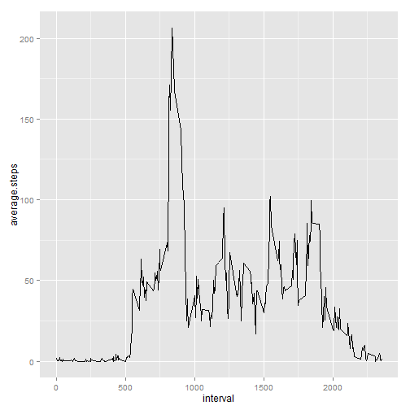

# Reproducible Research: Peer Assessment 1


## Loading and preprocessing the data

```r
unzip('activity.zip')
accel <- read.csv('activity.csv', header=TRUE, sep = ',')
str(accel)
```

```
## 'data.frame':	17568 obs. of  3 variables:
##  $ steps   : int  NA NA NA NA NA NA NA NA NA NA ...
##  $ date    : Factor w/ 61 levels "2012-10-01","2012-10-02",..: 1 1 1 1 1 1 1 1 1 1 ...
##  $ interval: int  0 5 10 15 20 25 30 35 40 45 ...
```

```r
for(i in 1:length(accel) ) {
  str(accel[i])
  }
```

```
## 'data.frame':	17568 obs. of  1 variable:
##  $ steps: int  NA NA NA NA NA NA NA NA NA NA ...
## 'data.frame':	17568 obs. of  1 variable:
##  $ date: Factor w/ 61 levels "2012-10-01","2012-10-02",..: 1 1 1 1 1 1 1 1 1 1 ...
## 'data.frame':	17568 obs. of  1 variable:
##  $ interval: int  0 5 10 15 20 25 30 35 40 45 ...
```

We observe that the **date** variable is of the type **Factor**, we therefore recode it as a **date** variable.


```r
accel$date <- as.Date( accel$date, format = '%Y-%m-%d' )
str(accel$date)
```

```
##  Date[1:17568], format: "2012-10-01" "2012-10-01" "2012-10-01" "2012-10-01" ...
```

## What is mean total number of steps taken per day?
We start by loading the packages for data manipulation and plotting.


```r
library(plyr)
library(ggplot2)
```

We now compute the data needed for the plot.


```r
tot.steps <- ddply(accel, .(date),
                  summarize,
                  total.steps = sum(steps)
                  )
head(tot.steps)
```

```
##         date total.steps
## 1 2012-10-01          NA
## 2 2012-10-02         126
## 3 2012-10-03       11352
## 4 2012-10-04       12116
## 5 2012-10-05       13294
## 6 2012-10-06       15420
```

We can now plot the data.


```r
tot.st.plot <- ggplot(tot.steps,
                      aes(x = total.steps)
                      )
tot.st.plot <- tot.st.plot + geom_histogram()
print(tot.st.plot)
```

```
## stat_bin: binwidth defaulted to range/30. Use 'binwidth = x' to adjust this.
```

 

Lastly we can report the summary statistics, to see the mean and median.


```r
summary(tot.steps$total.steps)
```

```
##    Min. 1st Qu.  Median    Mean 3rd Qu.    Max.    NA's 
##      41    8840   10800   10800   13300   21200       8
```

```r
summary(tot.steps$total.steps)['Mean']
```

```
##  Mean 
## 10800
```

```r
summary(tot.steps$total.steps)['Median']
```

```
## Median 
##  10800
```

## What is the average daily activity pattern?
Compute the data needed for the plot.


```r
av.steps <- ddply(accel, .(interval),
                  summarize,
                  average.steps = mean(steps, na.rm=TRUE )
                  )
head(av.steps)
```

```
##   interval average.steps
## 1        0       1.71698
## 2        5       0.33962
## 3       10       0.13208
## 4       15       0.15094
## 5       20       0.07547
## 6       25       2.09434
```

Plot the computed data.


```r
av.st.plot <- ggplot(av.steps,
                     aes(interval, average.steps)
                     )
av.st.plot <- av.st.plot + geom_line()
print(av.st.plot)
```

 


Find the maximum.


```r
summary(av.steps$average.steps)
```

```
##    Min. 1st Qu.  Median    Mean 3rd Qu.    Max. 
##    0.00    2.49   34.10   37.40   52.80  206.00
```

```r
summary(av.steps$average.steps)['Max.']
```

```
## Max. 
##  206
```


## Imputing missing values


## Are there differences in activity patterns between weekdays and weekends?
